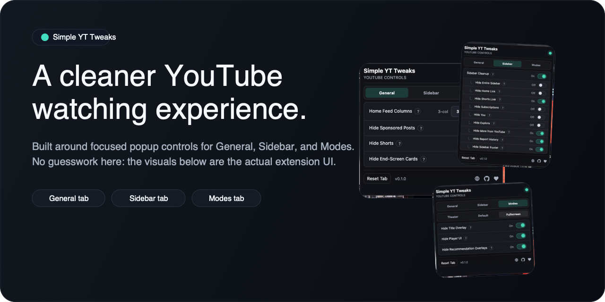
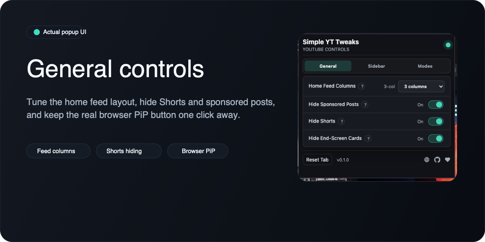
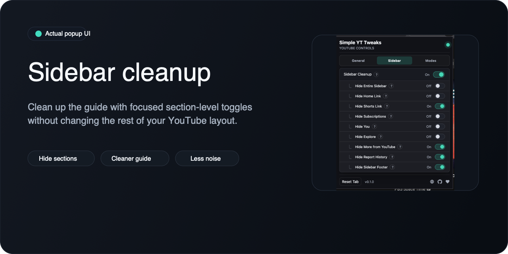
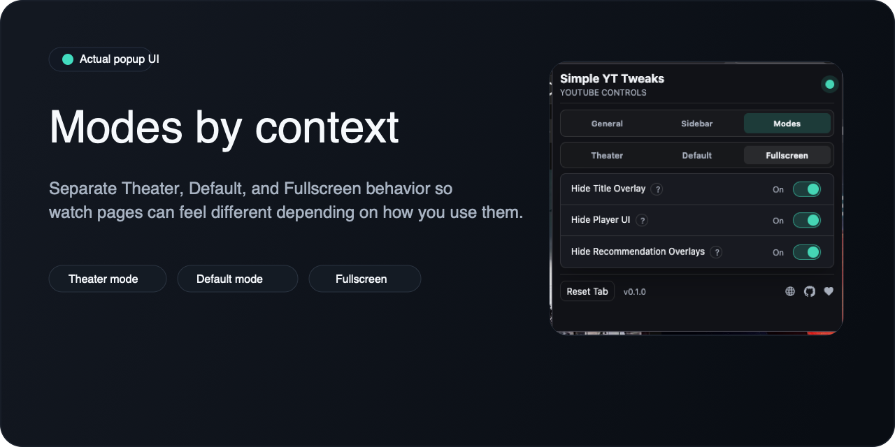

# Simple YT Tweaks

Simple YT Tweaks is an unofficial Manifest V3 Chrome/Brave extension that bundles a focused set of YouTube usability tweaks into one small package.

This project is not affiliated with, endorsed by, sponsored by, or otherwise associated with YouTube or Google.



## What It Does

- Cleans up watch pages with separate `Modes` settings for `Theater`, `Default`, and `Fullscreen`.
- Adds optional header, player UI, metadata, comments, recommendations, and live chat cleanup controls.
- Restores a real browser Picture-in-Picture button in the player controls.
- Adds a PiP handoff button inside YouTube's native miniplayer when YouTube shows that miniplayer naturally.
- Cleans up the left sidebar with optional section-level visibility controls.
- Hides Shorts and end-screen cards.
- Hides sponsored/promoted surfaces where they can be identified confidently.
- Lets you choose a 2, 3, or 4-column home feed layout.

## Popup Layout

- `General`: home feed columns, sponsored hiding, Shorts hiding, end-screen cards, PiP
- `Sidebar`: sidebar cleanup and section-level sidebar visibility controls
- `Modes`: separate `Theater`, `Default`, and `Fullscreen` behavior

## Feature Gallery





## Known Limitations

Current known limitations are tracked in [KNOWN_ISSUES.md](KNOWN_ISSUES.md). The main Picture-in-Picture button opens true browser PiP; native YouTube miniplayer behavior is owned by YouTube and the browser, and the extension does not try to force or suppress it.

## Development

```bash
npm install
npm run icons
npm run dev
```

Load `/Users/d4ngl/Git Repos/Codex/simple-yt-tweaks/dist` as an unpacked extension from `chrome://extensions` or `brave://extensions` with Developer mode enabled.

## Release Candidate Workflow

```bash
npm run typecheck
npm run lint
npm run build
npm run validate
npm run package
```

The packaged upload is written to:

`/Users/d4ngl/Git Repos/Codex/simple-yt-tweaks/release/simple-yt-tweaks-v<version>.zip`

### Manual Smoke Checklist

- Homepage: verify home feed columns, sponsored hiding, Shorts hiding, and sidebar cleanup
- Watch page in Default mode: verify recommendations/comments/metadata/live chat controls and PiP button behavior
- Watch page in Theater mode: verify enhanced theater layout, header hover, metadata behavior, and scrollbar behavior
- Fullscreen mode: verify title, player UI, recommendation overlay, and action overlay behavior
- Popup: verify settings persist after closing/reopening the popup and after YouTube navigation
- PiP: verify the restored button opens true browser PiP and the miniplayer PiP handoff appears only when YouTube's native miniplayer is present

## Versioning

The extension version is synced across `package.json`, `package-lock.json`, and `public/manifest.json`.

```bash
npm run version:set -- 0.2.0
```

Use `version:set` only when preparing a new release candidate or Web Store upload.

## Compatibility

Tested during development on:

- Brave Browser 146.1.88.136 on macOS

Chrome and Brave are the intended targets. Chrome stable should get one final smoke pass before the first public listing is submitted.

## Support

Feature requests and bug reports are welcome through GitHub issues. Maintenance is best-effort and there is no guaranteed support SLA.

## Privacy

Simple YT Tweaks does not collect, transmit, sell, or share user data. Settings are stored with Chrome extension storage only. See [PRIVACY.md](PRIVACY.md).

## License

MIT
